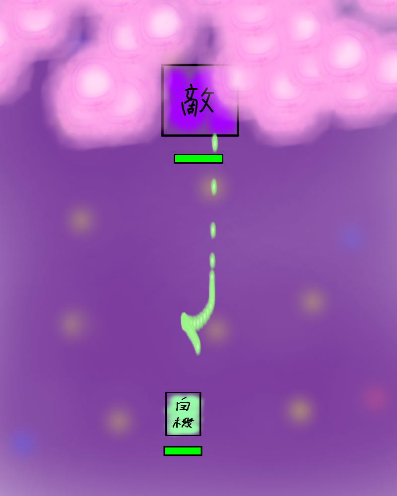
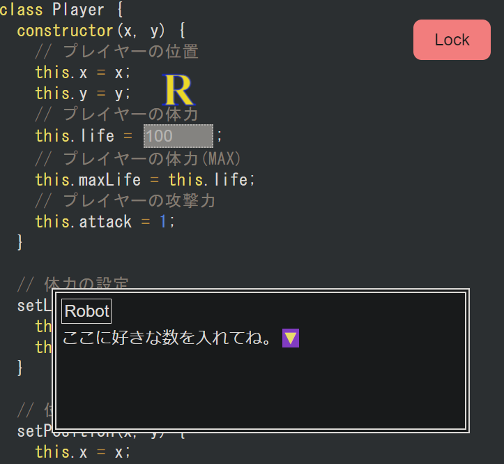

## リンク

[サイトへのリンク](https://cheaten.pages.dev)

[ソースへのリンク](https://github.com/tomsal25/cheaten)

## 概要

「チート」を使って、絶対にクリアできないゲームを攻略するゲーム。「チート」は実際にコードを書き換えることで実現し、直感的にプログラミング学習ができる狙い。

ゲーム画面(仮)

 

コード編集画面(仮)

## 使用技術

- ビルド: [Vite](https://github.com/vitejs/vite)

- フロントエンド
  - フレームワーク/ライブラリ: preact
  - その他ライブラリ
    - [Phaser](https://github.com/photonstorm/phaser)
    - [Nano Stores](https://github.com/nanostores/nanostores)

- バックエンド
  - 無し

## 余談

過去の自分のプログラム経験から、人のソースコードをいじって試行錯誤するのが一番楽しいと感じたためこのゲームを作成。

ゲームエンジン「Phaser」が1MB近くあるのでReactよりも軽量なpreactを採用した。React自体は学習経験があったのでpreactでも簡単に開発を行えた。
