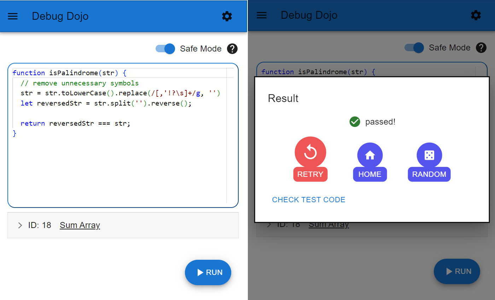

## リンク

[サイトへのリンク](https://debugdojo.netlify.app/)

## 概要

AIが生成した間違いを含むコードをデバッグするゲーム。現在、コードは静的に配信されたもののみ。

ゲームのプレイ画面

## 使用技術

- ビルド: [Vite](https://github.com/vitejs/vite)

- フロントエンド
  - フレームワーク/ライブラリ: React
  - その他ライブラリ
    - [Material UI](https://github.com/mui/material-ui) v5
    - [emotion](https://github.com/emotion-js/emotion)
    - [Monaco Editor](https://github.com/microsoft/monaco-editor)
    - [i18next](https://github.com/i18next/i18next)
    - [React Router](https://github.com/remix-run/react-router) v6

- バックエンド
  - [Netlify Functions](https://github.com/netlify/functions)

- その他
  - [Netlify CLI](https://github.com/netlify/cli)
  - ChatGPT API (gpt-3.5-turbo)

## 余談

Reactをふんだんに使ったアプリを作ってみたかったので、MUIを用いて開発をした。emotion(CSS in JS)を使うことは、はじめてだったが、容易に実装できた。しかし、MUIの独特の仕様(sx propや各種コンポーネントなど)に慣れるのは苦労した。

当時はSSRという概念を知らなかったため、React Routerを使ってルーティングを実装した。

デプロイ先にはじめてNetlifyを利用したが、GitHubとの連携もありすぐに利用できた。また、Netlify Functionsのおかげでサーバーサイドの存在を知れた。

本来ならば、AI(ChatGPT)を使ってコードの自動生成を行ったり、それを用いて対戦機能を実装したりする予定だったが、ChatGPTの出力精度を高められず断念した。
