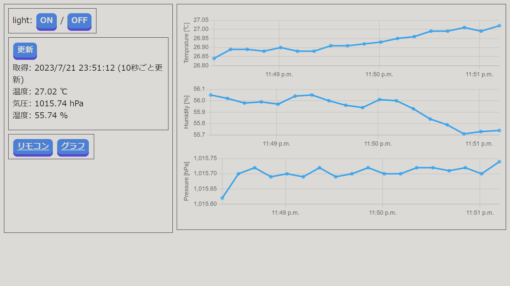
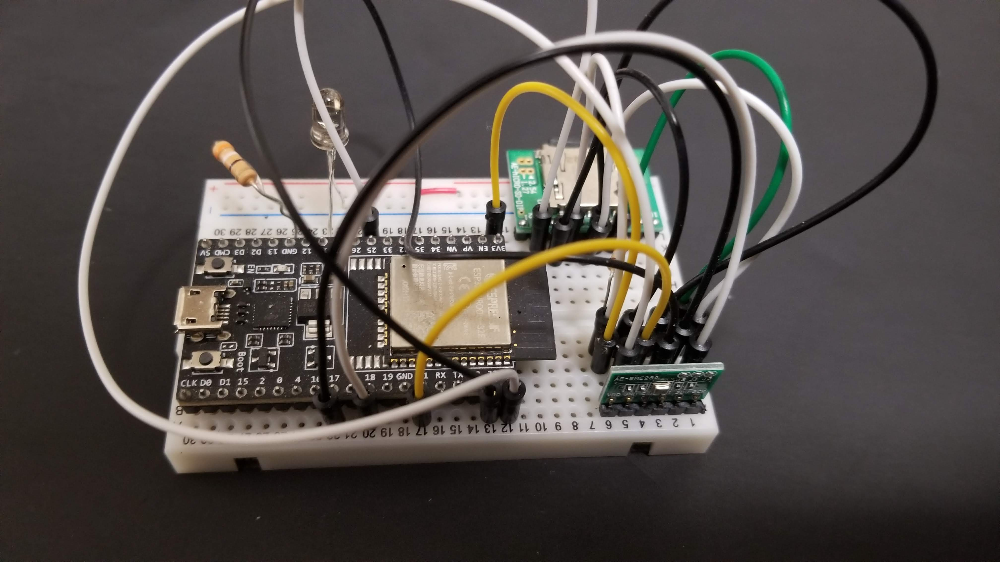
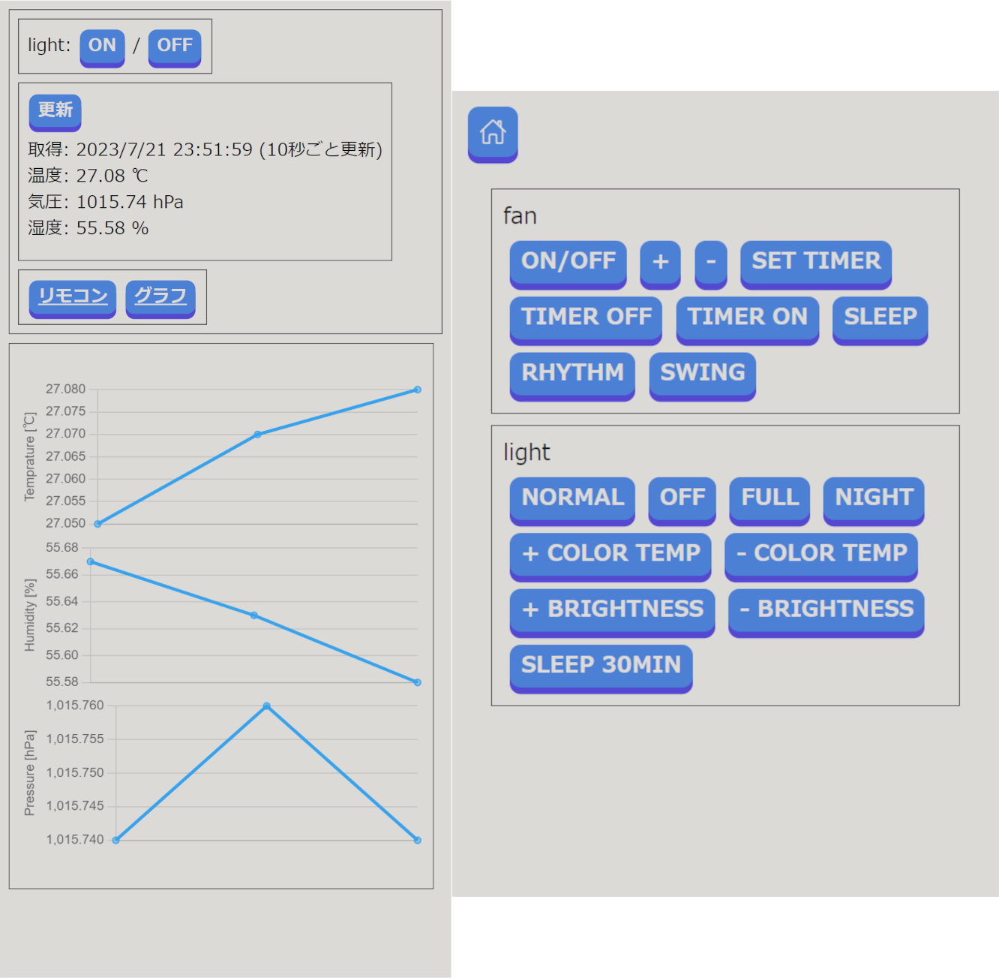

## 概要

ESP32を使って温湿度、気圧を測定し、ローカルネットワーク内の端末から確認できるようにする試み。また、測定値をSDカードに記録してデータベースを参照できるようにした。

ブラウザからアクセスできる計測画面

## 使用技術

- マイコン: [ESP32-WROOM-32E開発ボード](https://akizukidenshi.com/catalog/g/gM-15673)
- 開発環境: [PlatformIO](https://platformio.org)
- 使用ライブラリ
  - crankyoldgit/IRremoteESP8266@^2.8.2
  - ottowinter/ESPAsyncWebServer-esphome@^3.0.0
  - adafruit/Adafruit BME280 Library@^2.2.2
  - adafruit/SdFat - Adafruit Fork@^2.2.1

## 余談

マイコンに関して何も知見のない中での開発だったので、多くの点で苦労した。開発は主にC++だったが、大学でC言語を学んでいたこともあって言語的な障壁はあまり感じなかった。

ほとんどライブラリの力に頼らせていただいたが、サンプルとは違った挙動をしたり、応用しようとすると動かなかったりと予想外の状況に多く直面し開発は難航した。

実際の装置(右手前がセンサー、左奥がSDカード、左手前ESP32で左奥はリモコン用の赤外線LED)

 

また、元々は赤外線LEDを使ってリモコンを遠隔操作できるように組んだものだったが、機能を追加していくうちに大規模なものになってしまった。

スマホからの利用画面

