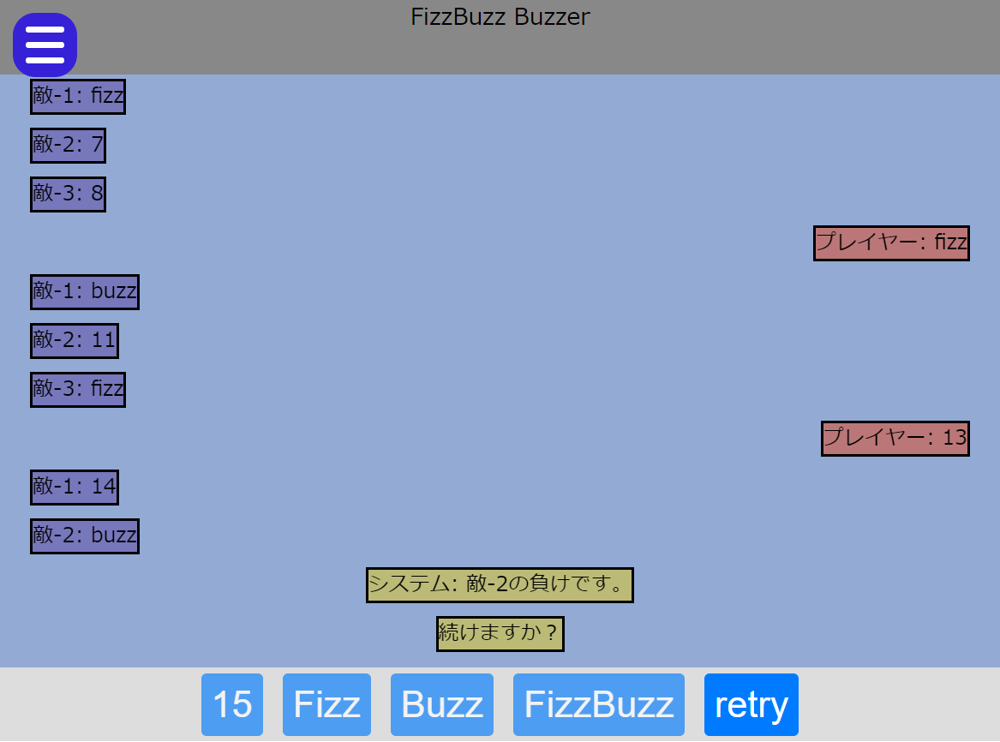

## リンク

[ゲームへのリンク](https://tomsal25.github.io/fizzbuzz-buzzer/)

[ソースへのリンク](https://github.com/tomsal25/fizzbuzz-buzzer)

## 概要

はじめて作成したWebアプリ。[Fizz Buzz問題](https://ja.wikipedia.org/wiki/Fizz_Buzz)が元ネタで、Fizz Buzzの規則にしたがって正しい数字のボタンを押すゲーム。

ゲームのプレイ画面

## 使用技術

- ビルド: webpack

- フロントエンド
  - フレームワーク/ライブラリ: Vanilla
  - その他ライブラリ
    - [simplebar](https://github.com/Grsmto/simplebar)

- バックエンド
  - 無し

- その他
  - GitHub Pages

## 余談

当時、React等のライブラリの存在は知っていたが、Vanillaでどこまで書けるのか気になったので挑戦したもの。ライブラリ「simplebar」は頑張れば自分でも実装できると判断して導入した。ゲームループを作るという発想がなく、進行の処理に苦労した記憶がある。

createElementのラッパー関数を作り、Reactのような書き方ができるようにしたが、大変なので今後は使うことはないと感じた。
